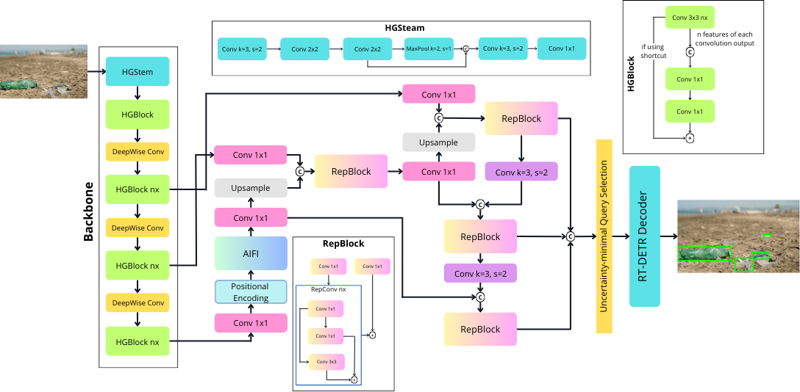

# Beach Litter Detection Using RT-DETR

 Miftahul Huda1 &nbsp;&nbsp;&nbsp; Dimas Rizky Ramadhani2 &nbsp;&nbsp;&nbsp; Nabila Azhari3 &nbsp;&nbsp;&nbsp; Arsyiah Azahra4 &nbsp;&nbsp;&nbsp; Putri Maulida Chairani5 

 
Detection and classification of litter on the beach is carried out using the Real-Time Detection Transformer (RT-DETR) model. RT-DETR is a transformer-based object detection architecture designed for real-time data processing with high performance https://arxiv.org/abs/2304.08069, making it very suitable for application in environmental monitoring tasks like this.

## RT-DETR Architecture

reference: https://arxiv.org/abs/2304.08069 and https://github.com/ultralytics/ultralytics/tree/main/ultralytics

## Dataset
The plastic litter dataset used is sourced from the following link https://universe.roboflow.com/monash-ventz/beach-waste-vqths with the following data usage license explanation https://creativecommons.org/licenses/by/4.0/.
RT-DETR was trained using 2675 training data to recognize several main labels included in the plastic waste category, such as:
- Bottle
- Clothes
- Metal
- Plastic
- Rope
- Styrofoam
- Wood

## Evaluation Results
There are 561 validation data without wood and clothes category for evaluation

| Class        | Images | Instances | Precision | Recall | mAP@IoU[50] | mAP@IoU[50-95] |
|--------------|--------|-----------|-----------|--------|-------------|----------------|
| **All**      | 561    | 2558      | 0.848     | 0.744  | 0.810       | 0.606          |
| **Bottle**   | 366    | 874       | 0.906     | 0.814  | 0.872       | 0.638          |
| **Metal**    | 228    | 458       | 0.882     | 0.852  | 0.878       | 0.648          |
| **Plastic**  | 331    | 603       | 0.838     | 0.776  | 0.819       | 0.636          |
| **Rope**     | 155    | 205       | 0.709     | 0.512  | 0.619       | 0.409          |
| **Styrofoam**| 195    | 418       | 0.904     | 0.765  | 0.861       | 0.697          |

## Inference

## Reference
[1] Monash, "Beach Waste Dataset," *Roboflow Universe*. Roboflow, Oct. 2024. [Online]. Available: [https://universe.roboflow.com/monash-ventz/beach-waste-vqths](https://universe.roboflow.com/monash-ventz/beach-waste-vqths). Accessed: Nov. 19, 2024.

[2] Y. Zhao, W. Lv, S. Xu, J. Wei, G. Wang, Q. Dang, Y. Liu, and J. Chen, "DETRs Beat YOLOs on Real-time Object Detection," *arXiv preprint*, 2024. [Online]. Available: [https://arxiv.org/abs/2304.08069](https://arxiv.org/abs/2304.08069).

[3] Ultralytics, "Ultralytics Neural Network Modules," GitHub repository, 2024. [Online]. Available: https://github.com/ultralytics/ultralytics/tree/main/ultralytics/nn/modules. [Accessed: Dec. 1, 2024].

